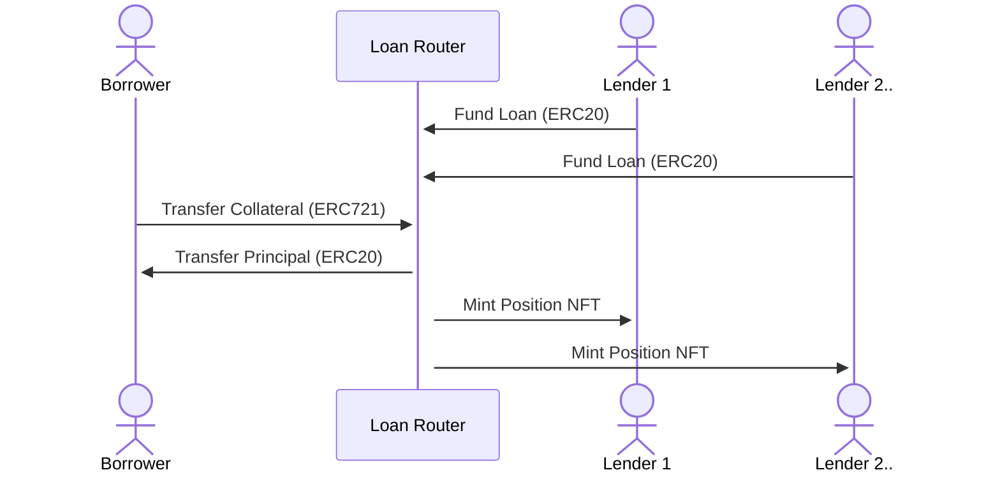
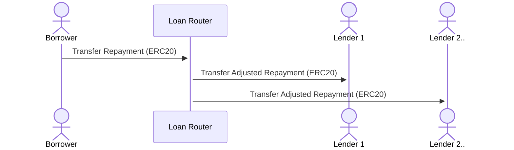
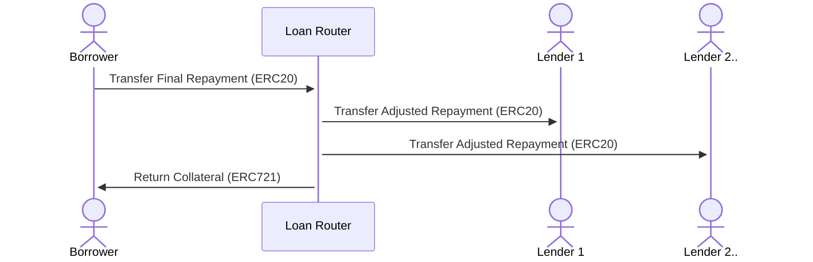
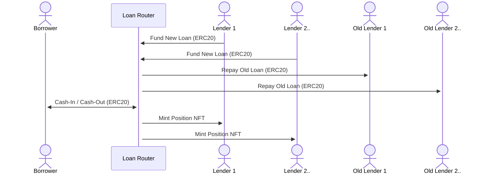
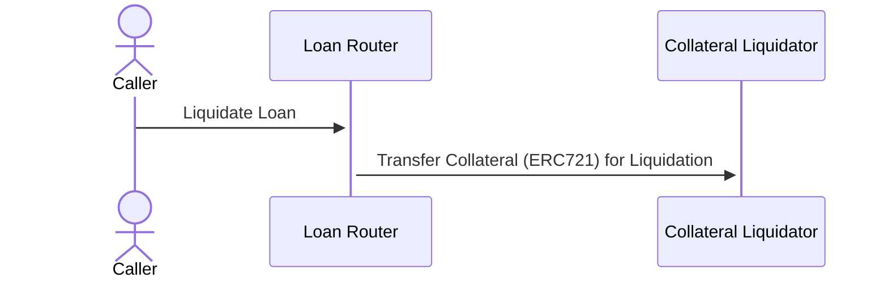
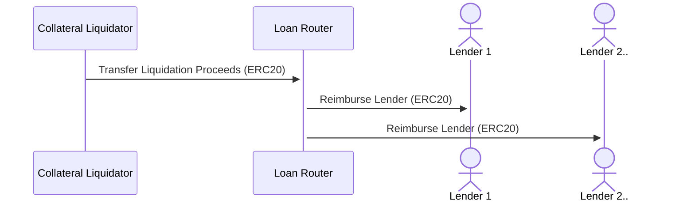
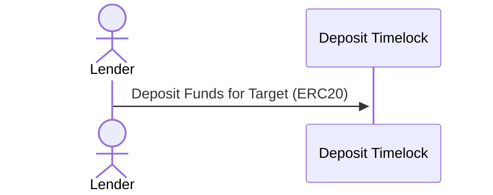
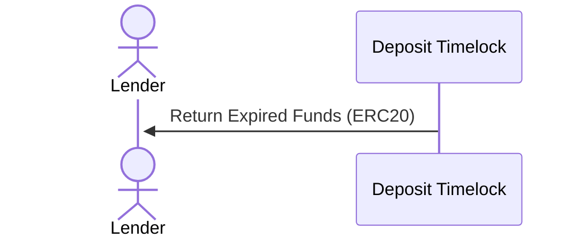
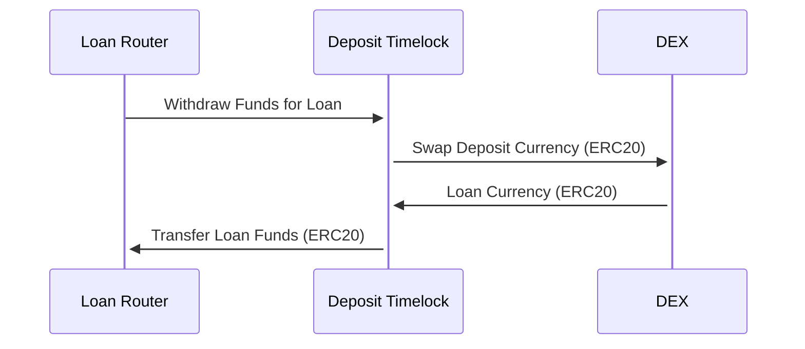

# MetaStreet Loan Router Design

MetaStreet Loan Router is a permissionless, peer-to-peer lending protocol for
NFT collateral with tranching, periodic repayments, and flexible interest rate
models. Loan terms are determined offchain, signed on to by lenders, and then
executed onchain by the borrower.

## Loan Terms

```solidity
struct FeeSpec {
    uint256 originationFee;
    uint256 exitFee;
}

struct TrancheSpec {
    address lender;
    uint256 amount;
    uint256 rate;
}

struct LoanTerms {
    uint64 expiration;
    address borrower;
    address depositTimelock;
    address currencyToken;
    address collateralToken;
    uint256 collateralTokenId;
    uint64 duration;
    uint64 repaymentInterval;
    address interestRateModel;
    uint256 gracePeriodRate;
    uint256 gracePeriodDuration;
    FeeSpec feeSpec;
    TrancheSpec[] trancheSpecs;
    bytes options;
}
```

Loan terms specify all relevant details for a loan, like collateral, lending
tranches, duration, interest rate model, fees, etc. Loan terms are passed as
calldata to the MetaStreet Loan Router contract to optimize for storage and
gas.

## Borrow Flow

Once loan terms are agreed to offchain, the borrower can call `borrow()` to
borrow the loan principal from the specified tranches for the specified
duration, in exchange for NFT collateral.

**`borrow(LoanTerms calldata loanTerms, bytes[] calldata lenderSignatures)`**



Borrowers periodically pay down their loan with the `repay()` call. Borrowers
can also prepay their loan to reduce the principal and effective interest
expense. In the case of late repayments, borrowers are subject to a grace
period interest rate penalty. On final repayment, the collateral is returned to
the borrower.

**`repay(LoanTerms calldata loanTerms, uint256 amount)`**





Borrowers can refinance their loan to new loan terms with the `refinance()`
call. Depending on the new loan principal and outstanding old loan balance,
this may result in a cash-in or cash-out transfer.

**`refinance(LoanTerms calldata loanTerms, LoanTerms calldata newLoanTerms)`**



In the case of a lapse in repayment beyond the repayment interval and grace
period duration, the loan is subject to liquidation, which can be triggered by
any party with the `liquidate()` call. The loan collateral is then transferred
to an external collateral liquidator, such as
`EnglishAuctionCollateralLiquidator`, to be liquidated for some amount of
proceeds.

**`liquidate(LoanTerms calldata loanTerms)`**



On completed collateral liquidation, the collateral liquidator calls the
`onCollateralLiquidator()` callback on the MetaStreet Loan Router with the
total liquidation proceeds. Liquidation proceeds are remitted to lenders in
order of tranche seniority, with any accrued interest since the last repayment.

**`onCollateralLiquidated(bytes calldata context, uint256 proceeds)`**



## Interest Rate Model

The interest rate model specified in the loan terms implement the
`IInterestRateModel` interface, which provides a stateless API for determining
the amount of interest owed, given the loan terms and elapsed time since last
repayment. Currently, the `SimpleInterestRateModel` implements a loan repayment
schedule with fixed principal payments and simple interest, and the
`AmortizedInterestRateModel` implements an amortized loan repayment schedule
with fixed overall repayments and simple interest.

Future interest rate models maybe implement variable interest rates indexed to
an external oracle.

## Deposit Timelock

The `DepositTimelock` is an optional external component for escrowing lender
funds in advance of large loans. It provides a permissionless API for lenders
to deposit funds with an expiration time. Funds can be withdrawn by the
MetaStreet Loan Router to fund a loan when it is ready to be executed by the
borrower. In the case of expiration, lenders can retrieve their deposited
funds.

The `DepositTimelock` also supports swapping a yield-bearing deposit currency
token for a different currency token on withdraw, to allow lending capital
to continue to earn yield while it is in escrow.

Lenders call `deposit()` to deposit funds with an expiration. The target and
context ensure that the funds can only be withdrawn by a specific address, e.g.
the MetaStreet Loan Router.

**`deposit(address target, bytes32 context, address token, uint256 amount, uint64 expiration)`**



On expiration without loan execution, lenders can call `cancel()` to retrieve
deposited funds.

**`cancel(address target, bytes32 context)`**



On loan execution, the MetaStreet Loan Router calls `withdraw()` for each
lender to collect the funds for the loan principal, potentially triggering a
swap from the deposit currency token to loan currency token.

**`withdraw(bytes32 context, address depositor, address withdrawToken, uint256 amount, bytes calldata swapData)`**


